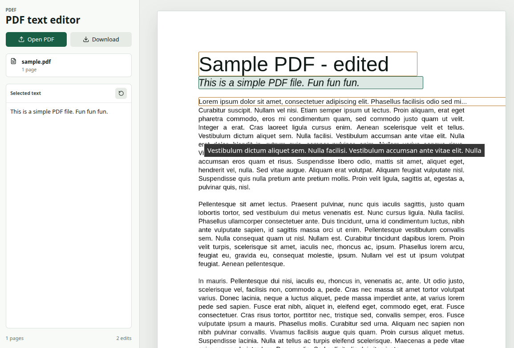

# Pdef

Small browser PDF editor for changing existing text and placing local images.

Images can be selected from the hard drive (or dropped onto the app), placed on any page, moved, resized from their corners, and included in the downloaded PDF.

Existing PDF form text fields, segmented/comb fields, and checkboxes can be filled directly on the page and are saved with the downloaded PDF.



## Local development

```sh
npm install
npm run dev
```

## Static build

```sh
npm run build
```

The static site is written to `dist/`.
